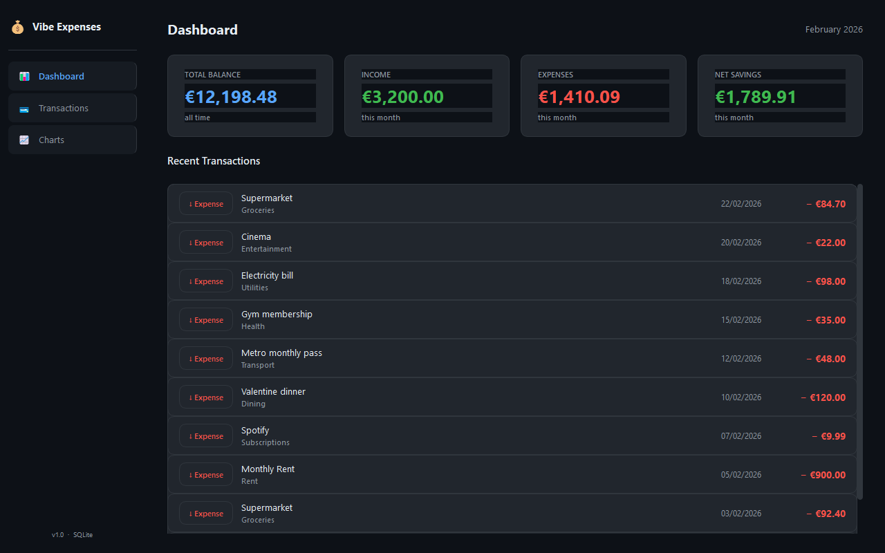

# 💰 Vibe Expenses

A clean, dark-themed desktop app for tracking personal income and expenses — built with Python and PyQt6.


---

## Screenshots

| Dashboard |
|---|---|
|  |  |

---

## Features

- **Dashboard** — live summary cards (total balance, income, expenses, net savings) + recent transactions
- **Transactions** — full table with search, type & tag filters, inline add/edit/delete (`Ctrl+N` to add)
- **Charts & Analytics** — three chart types with a flexible period picker:
  - 📊 Income vs Expenses (grouped bar, auto-switches to daily for short periods)
  - 🍩 Spending by Tag (donut with legend)
  - 📈 Balance Trend (cumulative line chart)
- **Period filter** — All Time · This Week · This Month · Last Month · This Year · Custom range
- **Tags as categories** — comma-separated tags on each transaction, used for charts and filtering
- **Local SQLite storage** — single `expenses.db` file, no cloud, no accounts
- **Dark fintech theme** — GitHub-dark-inspired palette throughout, including charts

---

## Getting Started

### Prerequisites

- Python 3.12+
- pip

### Install & Run

```bash
git clone https://github.com/your-username/vibe-expenses.git
cd vibe-expenses

pip install -r requirements.txt

python main.py
```

Or on Windows, double-click **`install.bat`** then **`run.bat`**.

---

## Build a standalone .exe

No Python required on the target machine.

```bash
# Double-click, or run from terminal:
build.bat
```

Output: `dist\VibeExpenses.exe`

The `.exe` can be moved anywhere. It will create/use `expenses.db` in the same folder as itself — your data travels with it.

---

## Project Structure

```
Expenses/
├── main.py               # Entry point
├── database.py           # All SQLite queries
├── styles.py             # Dark theme palette + QSS stylesheet
├── requirements.txt
├── build.bat             # PyInstaller build script
├── run.bat / install.bat # Dev shortcuts
└── views/
    ├── main_window.py    # Sidebar + page navigation
    ├── dashboard.py      # Summary cards + recent transactions
    ├── transactions.py   # Table with CRUD
    ├── charts.py         # Period picker + 3 matplotlib charts
    └── add_dialog.py     # Add / Edit transaction dialog
```

---

## Tech Stack

| Library | Purpose |
|---|---|
| [PyQt6](https://pypi.org/project/PyQt6/) | Desktop UI framework |
| [matplotlib](https://matplotlib.org/) | Embedded charts |
| [NumPy](https://numpy.org/) | Chart data processing |
| SQLite3 | Local data storage (stdlib) |
| [PyInstaller](https://pyinstaller.org/) | Standalone .exe packaging |

---

## Data & Privacy

All data is stored locally in `expenses.db` (SQLite). Nothing is ever sent anywhere. The database file is listed in `.gitignore` so your personal finances are never accidentally committed.

---

## License

MIT
